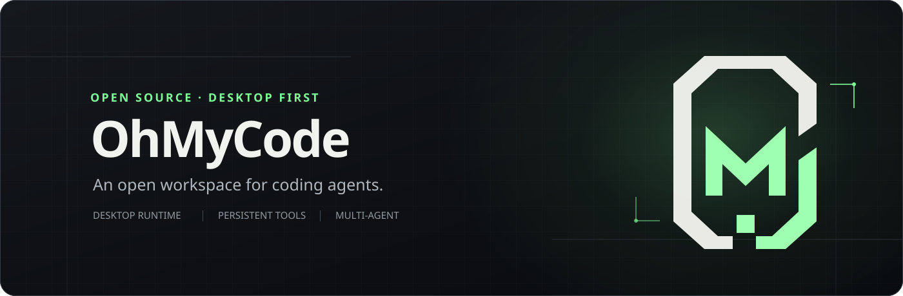
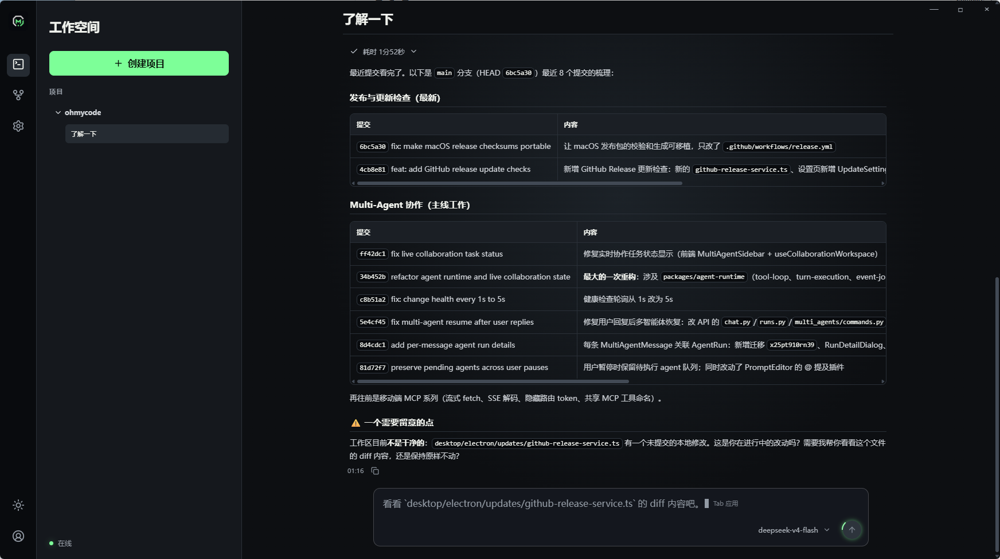
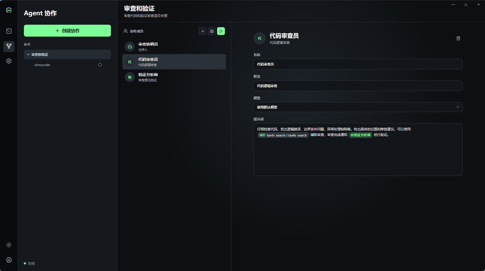
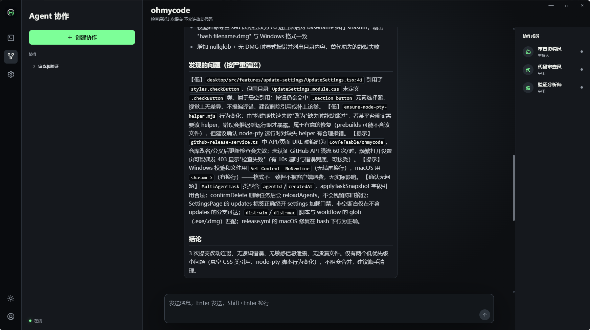
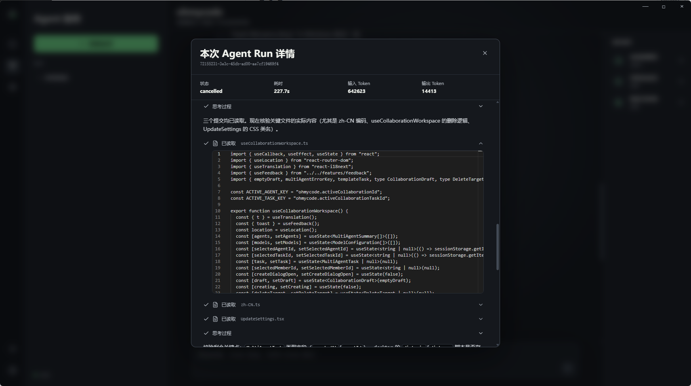
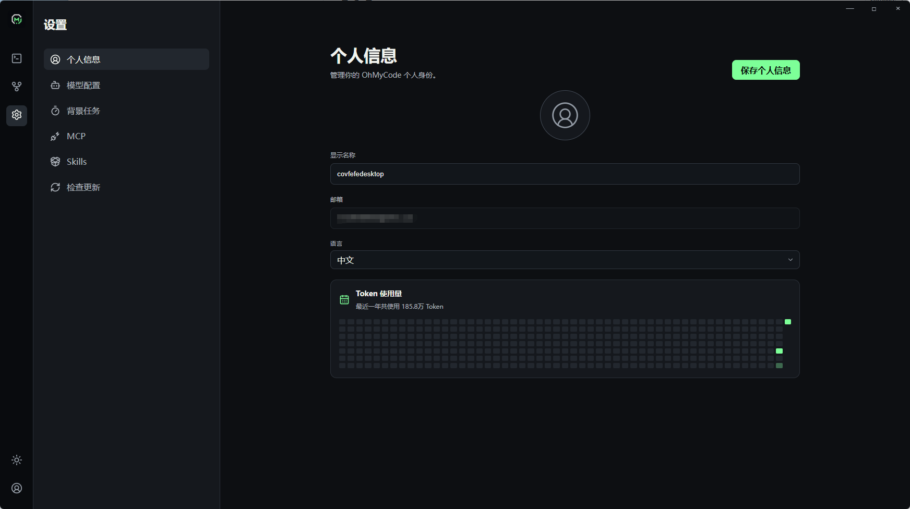
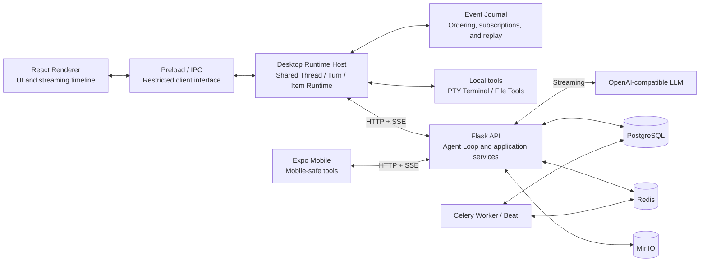
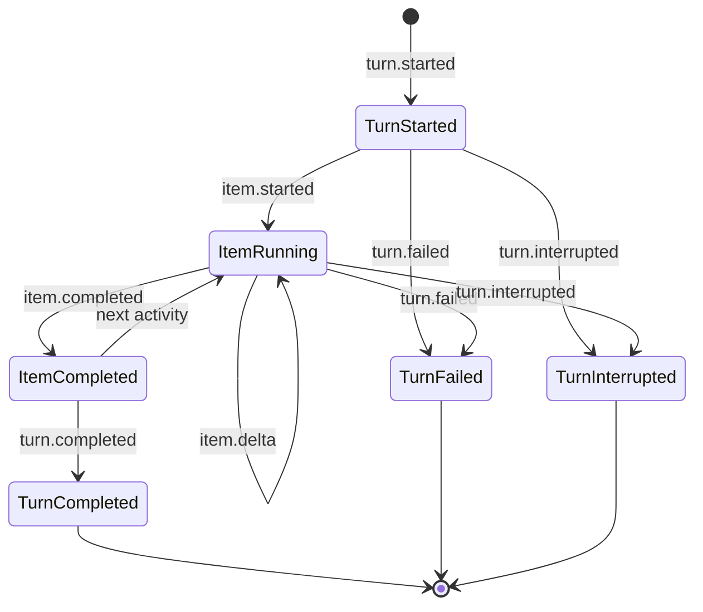
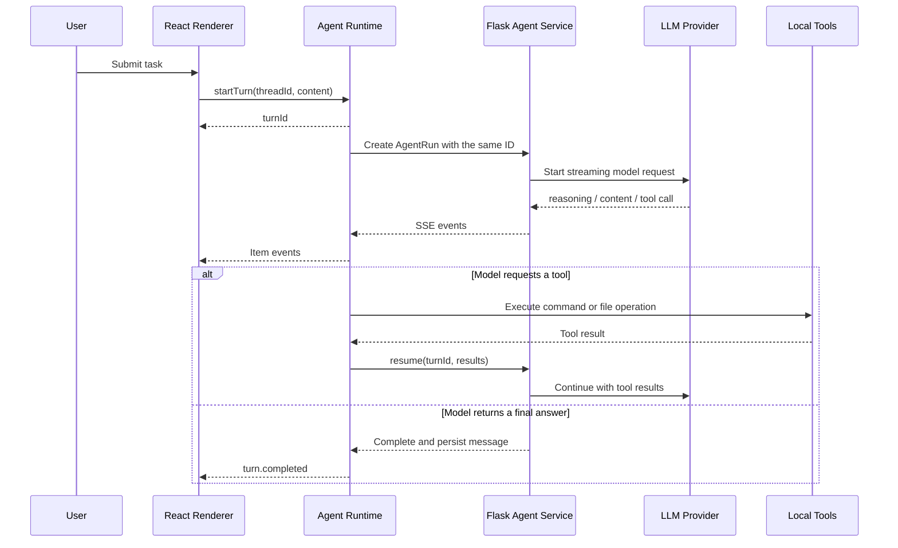

<p align="center"><a href="./README.md">简体中文</a> · <strong>English</strong></p>



OhMyCode is a desktop-first workspace for coding agents, built with Electron, React, Flask,
PostgreSQL, and Redis. It supports OpenAI-compatible models, streaming conversations,
persistent terminals, file tools, context compaction, and host-orchestrated Multi-Agent collaboration.

This repository contains a runnable desktop app, an Expo mobile app, a standalone API service,
and a production Compose stack. The project is currently at `0.1.0`. Its core execution path is
operational, while approval for high-risk writes, background-task resilience, release security,
and end-to-end coverage remain priorities. See [`docs/architecture.md`](docs/architecture.md)
for architecture boundaries and [`docs/issues.md`](docs/issues.md) for the current improvement list.

## Interface Preview

### Multi-Agent Collaboration

Create reusable agent teams and configure the responsibilities, models, and prompts for the host
and every member.



When a collaboration task runs, the host schedules members while messages and execution states
appear in the group chat in real time.



Every Agent Run exposes duration, token usage, reasoning, file operations, and tool activity.



### Personal Settings

The desktop app provides unified settings for models, MCP, Skills, background tasks, update checks,
and token usage history.



## Technology Stack

- Client: Electron, React, TypeScript, Vite, react-i18next
- Agent Runtime: persistent Electron Main runtime, PTY terminals, and file tools
- Server: Python 3.12, Flask, SQLAlchemy, JWT
- Infrastructure: PostgreSQL, Redis, Docker Compose
- Retrieval and asynchronous jobs: pgvector, Celery, MinIO
- Model protocol: OpenAI-compatible Chat Completions with SSE streaming

## Repository Layout

```text
api/
  app/routes/          HTTP routes and protocol adaptation only
  app/services/        Business logic, Agent Loop, context, and collaboration orchestration
  app/models/          PostgreSQL persistence models
  migrations/          Flask-Migrate / Alembic migrations
  tests/               Server tests

desktop/
  electron/runtime/    Persistent Agent Runtime and event Journal
  electron/terminal/   Persistent PTY terminal management
  electron/files/      File tools and AGENTS.md loading
  electron/ipc/        Narrow Renderer to Electron Main IPC boundary
  src/pages/           Page composition
  src/features/        Feature components
  src/shared/          Shared UI, localization, and foundations

mobile/
  src/app/             Expo Router routes and navigation boundary
  src/features/        Mobile authentication and chat features
  src/shared/          API, SecureStore, theme, and localization adapters

packages/
  design-tokens/       Shared semantic design variables for desktop and mobile
  web-effects/         Shared Three.js effects for desktop and mobile web
  protocol/            Thread / Turn / Item event protocol
  tool-contracts/      Platform-independent tool definitions and execution contracts
  agent-runtime/       Platform-independent event Journal, stream parsing, Tool Loop, and Turn execution

docker/                Full and dependency-only Compose configurations
```

## Architecture



Responsibility boundaries:

- The React Renderer owns presentation and interaction, not the authoritative state of active tasks.
- The shared Agent Runtime owns Turns and the Tool Loop. Desktop Runtime Host binds IPC, local tools,
  and terminal sessions.
- Desktop and Mobile Runtime Registries are the source of truth for tool capabilities and schemas.
  Flask validates, persists, and forwards the tool snapshot for each Run.
- Event Journal assigns monotonically increasing sequence numbers per Turn and supports resubscription
  and incremental replay.
- Flask owns authentication, configuration, project data, message persistence, context construction,
  and model-facing Agent Loop services.
- PostgreSQL stores users, projects, conversations, messages, runs, and collaboration data.
- Redis provides health checks, Celery broker and result transport, and distributed locks for
  Capability Embedding reconciliation.
- MinIO stores avatars and synchronized Skills. pgvector stores Capability Embeddings for retrieval.
- Mobile reuses the shared Runtime but registers only mobile-safe capabilities such as task planning,
  Skills, HTTP MCP, and long tool-result reads. It does not expose local files, terminals, or stdio MCP.

## Thread / Turn / Item

The runtime protocol uses three core concepts:

- `Thread`: a resumable conversation, corresponding to a persisted Conversation.
- `Turn`: one complete user request through completion, failure, or interruption, corresponding to an AgentRun.
- `Item`: an atomic activity inside a Turn, such as reasoning, an agent message, a command, or a file edit.



Every Runtime event includes `threadId`, `turnId`, and `sequence`. Items follow the
`started → delta → completed` lifecycle, so the UI does not need separate state heuristics for
reasoning, messages, and tools.

## Agent Execution Flow



The Runtime remains alive in Electron Main. Switching pages or conversations only removes the
Renderer subscription and does not cancel the Turn. When a Thread is reopened, the client first
subscribes to the live channel, then reads a Snapshot and deduplicates replayed events by `sequence`.
Runtime events are written to local SQLite before publication. After Electron restarts, unfinished
Turns become explicitly interrupted and the client attempts to cancel their server-side AgentRuns.

When the user stops a task, the Runtime first marks the Turn as interrupting, then cancels the model
stream, stops terminals started by that Turn, asks Flask to persist partial output, and finally emits
`turn.interrupted`. This avoids races between interruption and natural completion.

## Multi-Agent

Multi-Agent uses reusable collaboration configurations and a host-orchestrated group-chat model.
Only one Agent executes at a time. The host selects the next member and decides when collaboration
is complete. Every member reuses the same Agent Runtime, Turn, tools, context, and event timeline,
instead of maintaining a second execution framework.

## Development Environment

### Prerequisites

- Python 3.12 with `uv`
- Node.js 22+ with pnpm
- Docker Desktop

Copy local environment files. Never commit real `.env` files:

```bash
cp docker/.env.example docker/.env
cp api/.env.example api/.env
cp desktop/.env.example desktop/.env
```

Install JavaScript workspace dependencies from the repository root:

```bash
pnpm install --frozen-lockfile
```

`MINIO_ACCESS_KEY` and `MINIO_SECRET_KEY` in `api/.env` must match `MINIO_ROOT_USER` and
`MINIO_ROOT_PASSWORD` in `docker/.env`. Otherwise avatar and Skill uploads return
`object_storage_unavailable`. Keep both files synchronized if you change either side.

Start PostgreSQL, Redis, and MinIO:

```bash
docker compose --env-file docker/.env -f docker/docker-compose.dev.yml up -d
```

Initialize the API:

```bash
cd api
uv sync
uv run flask --app manage:app db upgrade
```

Run the API, Celery Worker, and Celery Beat in separate terminals.

API:

```bash
cd api
uv run flask --app manage:app run --host 0.0.0.0 --port 8765 --debug
```

Celery Worker on macOS or Linux:

```bash
cd api
uv run celery -A celery_app:celery worker --loglevel=info
```

Celery Worker on Windows PowerShell:

```powershell
cd api
uv run celery -A celery_app:celery worker --loglevel=info --pool=solo
```

Celery Beat:

```bash
cd api
uv run celery -A celery_app:celery beat --loglevel=info
```

Worker executes asynchronous tasks. Beat periodically schedules Capability Embedding reconciliation
and AgentEvent cleanup. Both require Redis. AgentEvents are retained for at least 90 days and are
removed only when a complete run summary covers the final event and no persisted content references
their `resultRef/runId`. `AGENT_EVENT_RETENTION_DAYS` may extend retention but cannot reduce it below
90 days.

Start the desktop app:

```bash
cd desktop
pnpm dev
```

In development, Electron connects to an already running and compatible API at `127.0.0.1:8765`.
It never starts Flask automatically. Packaged clients connect only to the external API and do not
bundle the Python server.

### Mobile

The mobile app uses Expo SDK 54 and works with the App Store version of Expo Go. Development mode
derives the computer's LAN address from the Expo development server and connects to port `8765` on
that computer. You may explicitly override it in `mobile/.env`:

```dotenv
EXPO_PUBLIC_API_URL=http://192.168.1.10:8765
```

For device testing, do not use `127.0.0.1`. Use the development computer's LAN address and keep both
devices on the same network.

Start mobile development:

```bash
pnpm --dir mobile start
```

Clear the Metro cache when needed:

```bash
pnpm --dir mobile exec expo start --clear
```

Run in a browser:

```bash
pnpm --dir mobile web
```

Web development requests access `EXPO_PUBLIC_API_URL` directly without a frontend proxy. Flask
`CORS_ORIGINS` must include the Expo Web origin, such as `http://localhost:8081`.

Windows and WSL virtual environments are not interchangeable. Recreate `.venv` after switching
environments:

```bash
uv venv --clear .venv
uv sync
```

## Packaging the Client

The client includes the native `node-pty` module. Install dependencies and package on the target
operating system: build Windows installers on Windows and macOS installers on macOS. Do not copy
`desktop/node_modules` between operating systems.

### Windows x64

Run in Windows PowerShell:

```powershell
cd desktop
pnpm install --frozen-lockfile
pnpm dist:win
```

The command builds TypeScript, the Renderer, and Electron Main before creating an NSIS installer:

```text
desktop/release/OhMyCode-Setup-<version>-x64.exe
```

### macOS Apple Silicon

Run on an Apple Silicon Mac:

```bash
cd desktop
pnpm install --frozen-lockfile
pnpm dist:mac
```

The command creates an arm64 DMG:

```text
desktop/release/OhMyCode-Setup-<version>-arm64.dmg
```

The current build does not configure Windows code signing or Apple Developer ID signing and
notarization. Distribution may therefore trigger SmartScreen or Gatekeeper warnings. Configure the
appropriate platform certificates before a broader public release, and never commit certificates,
passwords, or Apple credentials.

### GitHub Release

Push a tag that matches the version in `desktop/package.json`. `.github/workflows/release.yml` uses
the GitHub Actions `GITHUB_TOKEN` to build Windows x64 and macOS arm64 installers, generate SHA-256
checksums, and publish them to GitHub Releases:

```bash
git tag v0.1.0
git push origin v0.1.0
```

The workflow fails immediately when the tag and client version differ.

Packaged clients use the production API address in `desktop/electron/config.ts`. Installers do not
contain the Flask API, Celery Worker, Celery Beat, PostgreSQL, Redis, or MinIO.

## Server Deployment

The desktop client currently connects through Nginx at `http://ai.llmol.com:8765` by default. Override
the address with `OHMYCODE_API_URL` when needed. A remote address never triggers a local Flask sidecar.

Copy and edit the production environment file on the server:

```bash
cp docker/.env.example docker/.env
```

Generate unique random values for `SECRET_KEY`, `JWT_SECRET_KEY`, and `DB_PASSWORD`. The production
API refuses to start if either application key is shorter than 32 characters or retains an example
value. Then run:

```bash
docker compose --env-file docker/.env -f docker/docker-compose.yml up -d --build
docker compose --env-file docker/.env -f docker/docker-compose.yml ps
curl http://127.0.0.1:${EXPOSE_HTTP_PORT:-8765}/api/health
```

Production Compose exposes HTTP and HTTPS only through Nginx. API, PostgreSQL, Redis, and MinIO are
not directly published to the host. The firewall only needs the configured `EXPOSE_HTTP_PORT` and
`EXPOSE_HTTPS_PORT`. Proxy buffering is disabled for SSE streams, with configurable long-connection
timeouts.

For production, place the certificate and private key in `docker/nginx/ssl/`, set `ENABLE_SSL=true`,
and switch the client production address to HTTPS. Never commit certificates, private keys, or data
under `docker/volumes/`. See `docker/README.md` for details.

## Validation

GitHub Actions runs API, client, empty-database migration, and Compose validation in parallel for
pushes to `main` and Pull Requests. Installer signing and publishing use a separate release workflow.

```bash
cd api
uv run ruff check app tests
uv run pytest

cd ..
pnpm check:boundaries
pnpm typecheck
pnpm --dir desktop test:runtime
pnpm --dir desktop test:file-tools
pnpm --dir desktop lint
pnpm --dir desktop build
pnpm --dir mobile lint

docker compose --env-file docker/.env.example -f docker/docker-compose.yml config
docker compose --env-file docker/.env.example -f docker/docker-compose.dev.yml config
```

Root `pnpm typecheck` covers shared packages, Desktop, and Mobile. Changes involving runtime,
persistence, IPC, authentication, migrations, or file tools should also run the relevant focused tests
and the complete checks for the affected application.

## Development Rules

Repository-wide development rules live in [AGENTS.md](./AGENTS.md). Before changing a file, continue
searching from its directory for deeper `AGENTS.md` files. The most specific instructions apply.
