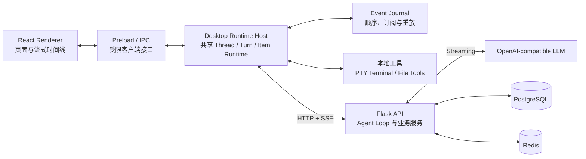
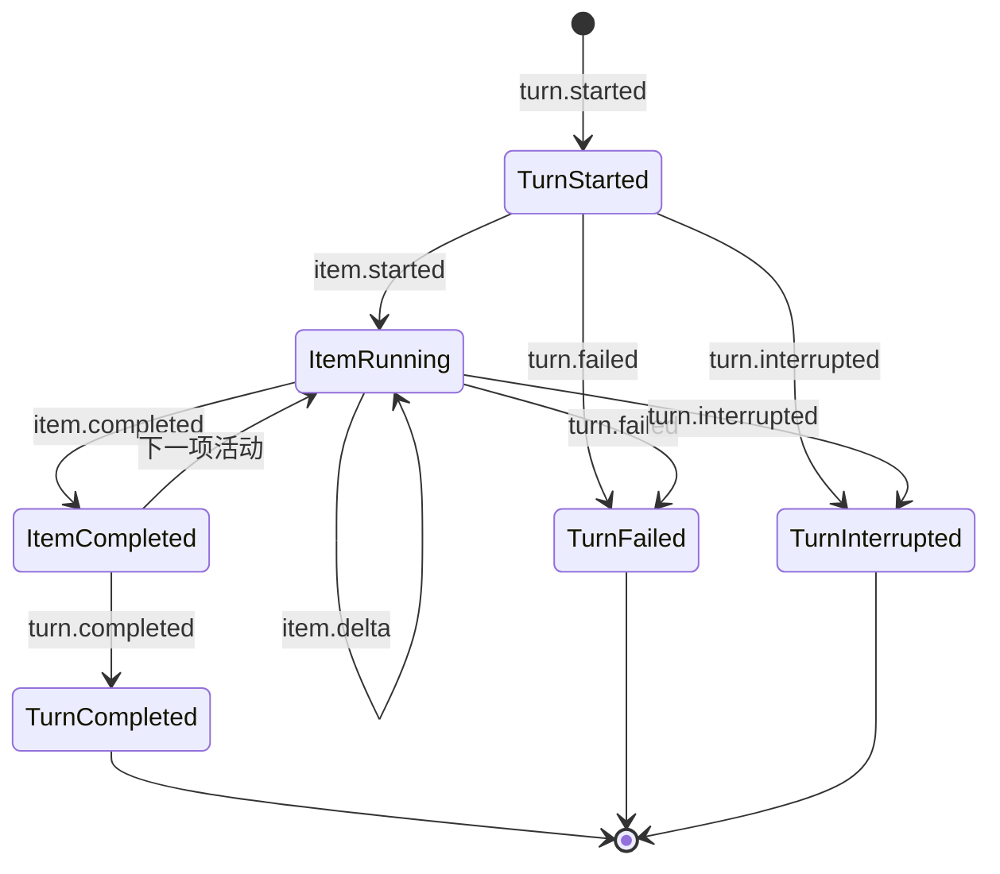
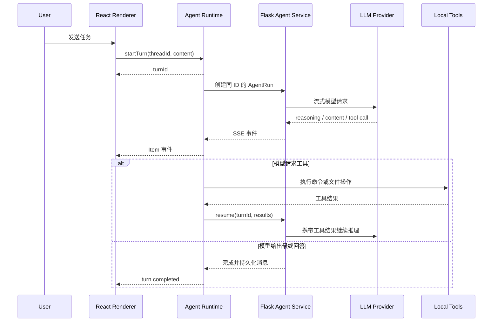

# OhMyCode

OhMyCode 是一个桌面优先的 Code Agent 工作空间，使用 Electron、React、Flask、
PostgreSQL 和 Redis 构建。它支持 OpenAI-compatible 模型、流式对话、持久终端、
文件工具、上下文压缩以及主持人调度的 Multi-Agent 协作。

## 技术栈

- 客户端：Electron、React、TypeScript、Vite、react-i18next
- Agent Runtime：Electron Main 常驻运行时、PTY 终端、文件工具
- 服务端：Python 3.12、Flask、SQLAlchemy、JWT
- 基础设施：PostgreSQL、Redis、Docker Compose
- 模型协议：OpenAI-compatible Chat Completions，SSE 流式响应

## 目录结构

```text
api/
  app/routes/          HTTP 路由，只处理协议适配
  app/services/        业务逻辑、Agent Loop、上下文与协作调度
  app/models/          PostgreSQL 数据模型
  migrations/          Flask-Migrate / Alembic 迁移
  tests/               服务端测试

desktop/
  electron/runtime/    常驻 Agent Runtime、事件 Journal
  electron/terminal/   持久 PTY 终端管理
  electron/files/      文件工具与 AGENTS.md 加载
  electron/ipc/        Renderer 与 Electron Main 的窄 IPC 边界
  src/pages/           页面组合
  src/features/        业务功能组件
  src/shared/          通用 UI、国际化与基础能力

packages/
  protocol/            Thread / Turn / Item 事件协议
  runtime-core/        跨平台事件 Journal 与执行状态
  tool-contracts/      平台无关工具定义与执行契约
  agent-runtime/       平台无关流式解析、Tool Loop 与 Turn 执行

docker/                完整与依赖服务 Compose 配置
```

## 整体架构



职责边界：

- React Renderer 只负责展示与用户交互，不拥有正在执行任务的真实状态。
- 共享 Agent Runtime 负责 Turn 与 Tool Loop；Desktop Runtime Host 绑定 IPC、本地工具和终端会话。
- Event Journal 为每个 Turn 分配单调递增序号，支持重新订阅和增量重放。
- Flask 负责认证、配置、项目数据、消息持久化、上下文构造和模型 Agent Loop。
- PostgreSQL 保存用户、项目、会话、消息、运行记录和协作数据；Redis 当前纳入服务健康检查，并为后续缓存和临时协调预留。

## Thread / Turn / Item

运行协议统一使用三个核心概念：

- `Thread`：一段可持续恢复的会话，对应当前持久层的 Conversation。
- `Turn`：一次用户请求到最终完成、失败或停止的完整执行，对应 AgentRun。
- `Item`：Turn 内的原子活动，例如思考、Agent 消息、命令或文件修改，对应 AgentEvent 语义。



所有 Runtime 事件都包含 `threadId`、`turnId` 和 `sequence`。Item 使用
`started → delta → completed` 生命周期，前端不再分别猜测思考、消息和工具的状态。

## Agent 执行流程



Runtime 在 Electron Main 进程中常驻。切换页面或会话只会取消 Renderer 的订阅，
不会取消 Turn。再次进入 Thread 时，客户端先订阅实时频道，再读取 Snapshot，并按
`sequence` 去重和重放，因此不会丢失切换期间产生的事件。Runtime 事件先写入本地
SQLite 再发布；Electron 进程重启后，未结束的 Turn 会恢复为明确的中断状态，并尝试
取消服务端对应的 AgentRun。

用户停止任务时，Runtime 先将 Turn 标记为正在中断，再取消模型流、停止该 Turn 启动的
终端、通知 Flask 持久化部分输出，最后发布 `turn.interrupted`，避免停止和自然完成互相竞争。

## Multi-Agent

Multi-Agent 使用可复用的协作配置和主持人调度的群聊模型。每次只有一个 Agent 执行，
主持人负责选择下一位成员和结束协作。各成员仍然复用相同的 Agent Runtime、Turn、工具、
上下文和事件时间线，不维护第二套执行框架。

## 开发环境

### 前置要求

- Python 3.12 与 `uv`
- Node.js 22+ 与 pnpm
- Docker Desktop

复制本地环境配置，真实 `.env` 不得提交：

```bash
cp docker/.env.example docker/.env
cp api/.env.example api/.env
cp desktop/.env.example desktop/.env
```

`api/.env` 中的 `MINIO_ACCESS_KEY` / `MINIO_SECRET_KEY` 必须分别与
`docker/.env` 中的 `MINIO_ROOT_USER` / `MINIO_ROOT_PASSWORD` 保持一致；否则头像和 Skill
对象上传会返回 `object_storage_unavailable`。复制示例后如果修改了一侧，也要同步修改另一侧。

启动 PostgreSQL、Redis 和 MinIO：

```bash
docker compose --env-file docker/.env -f docker/docker-compose.dev.yml up -d
```

初始化 API：

```bash
cd api
uv sync
uv run flask --app manage:app db upgrade
```

分别在独立终端中启动 API、Celery Worker 和 Celery Beat。

API：

```bash
cd api
uv run flask --app manage:app run --host 127.0.0.1 --port 8765 --debug
```

Celery Worker（macOS / Linux）：

```bash
cd api
uv run celery -A celery_app:celery worker --loglevel=info
```

Celery Worker（Windows PowerShell）：

```powershell
cd api
uv run celery -A celery_app:celery worker --loglevel=info --pool=solo
```

Celery Beat：

```bash
cd api
uv run celery -A celery_app:celery beat --loglevel=info
```

Worker 负责执行异步任务，Beat 负责定时投递存量 Capability Embedding
补偿任务；两者都依赖前面启动的 Redis。

启动桌面客户端：

```bash
cd desktop
pnpm install
pnpm dev
```

开发模式下 Electron 会复用已经运行且能力兼容的 `127.0.0.1:8765` API；如果没有找到，
会尝试启动本仓库中的 Flask 服务。打包后的客户端只连接外部 API，不捆绑 Python 服务端。

Windows 与 WSL 创建的 `.venv` 不能混用。如果切换运行环境，请执行：

```bash
uv venv --clear .venv
uv sync
```

## 客户端打包

客户端包含 `node-pty` 原生模块，应当在目标操作系统上安装依赖并打包：Windows 安装包在
Windows 上构建，macOS 安装包在 macOS 上构建。不要在不同操作系统之间复制
`desktop/node_modules`。

### Windows x64

在 Windows PowerShell 中执行：

```powershell
cd desktop
pnpm install --frozen-lockfile
pnpm dist:win
```

该命令会先完成 TypeScript、Renderer 和 Electron Main 构建，再生成 NSIS 安装程序：

```text
desktop/release/OhMyCode-Setup-<version>-x64.exe
```

### macOS Apple Silicon

在 Apple Silicon Mac（M1/M2/M3 等）的终端中执行：

```bash
cd desktop
pnpm install --frozen-lockfile
pnpm dist:mac
```

该命令生成 arm64 DMG：

```text
desktop/release/OhMyCode-Setup-<version>-arm64.dmg
```

当前构建没有配置 Windows 代码签名或 Apple Developer ID 签名与公证，因此分发给其他设备
时可能触发 SmartScreen 或 Gatekeeper 提示。正式公开发布前应配置对应平台的签名证书；
不要把证书、密码或 Apple 凭据写入仓库。

打包客户端默认连接 `desktop/electron/config.ts` 中的生产 API 地址。安装包不包含 Flask API、
Celery Worker、Celery Beat、PostgreSQL、Redis 或 MinIO。

## 服务端部署

当前桌面客户端默认通过 Nginx 连接 `http://ai.llmol.com:8765`，也可以通过
`OHMYCODE_API_URL` 覆盖。远程地址不会触发 Electron 的本地 API Sidecar。

在服务器上复制并修改生产环境文件：

```bash
cp docker/.env.example docker/.env
```

必须为 `SECRET_KEY`、`JWT_SECRET_KEY` 和 `DB_PASSWORD` 生成独立的随机值；两个应用密钥
少于 32 个字符或仍为示例值时，生产 API 会拒绝启动。然后执行：

```bash
docker compose --env-file docker/.env -f docker/docker-compose.yml up -d --build
docker compose --env-file docker/.env -f docker/docker-compose.yml ps
curl http://127.0.0.1:${EXPOSE_HTTP_PORT:-8765}/api/health
```

生产 Compose 只通过 Nginx 暴露 HTTP/HTTPS，API、PostgreSQL、Redis 和 MinIO 均不直接
暴露到宿主机。服务器防火墙只需放行配置的 `EXPOSE_HTTP_PORT` 和
`EXPOSE_HTTPS_PORT`。SSE 流式响应已关闭代理缓冲，并使用可配置的长连接超时。

正式部署应将证书和私钥放入 `docker/nginx/ssl/`，设置 `ENABLE_SSL=true`，并把客户端
生产地址切换为 HTTPS。证书文件、私钥和 `docker/volumes/` 数据都不得提交。详细说明见
`docker/README.md`。

## 验证

```bash
cd api
uv run ruff check app tests
uv run pytest

cd desktop
pnpm test:runtime
pnpm typecheck
pnpm lint
pnpm build

docker compose --env-file docker/.env.example -f docker/docker-compose.yml config
docker compose --env-file docker/.env.example -f docker/docker-compose.dev.yml config
```

## 开发约束

仓库级开发规则位于 [AGENTS.md](./AGENTS.md)。修改某个目录前，还应继续查找该目录到目标文件
路径上的更深层 `AGENTS.md`，更具体的规则优先。
